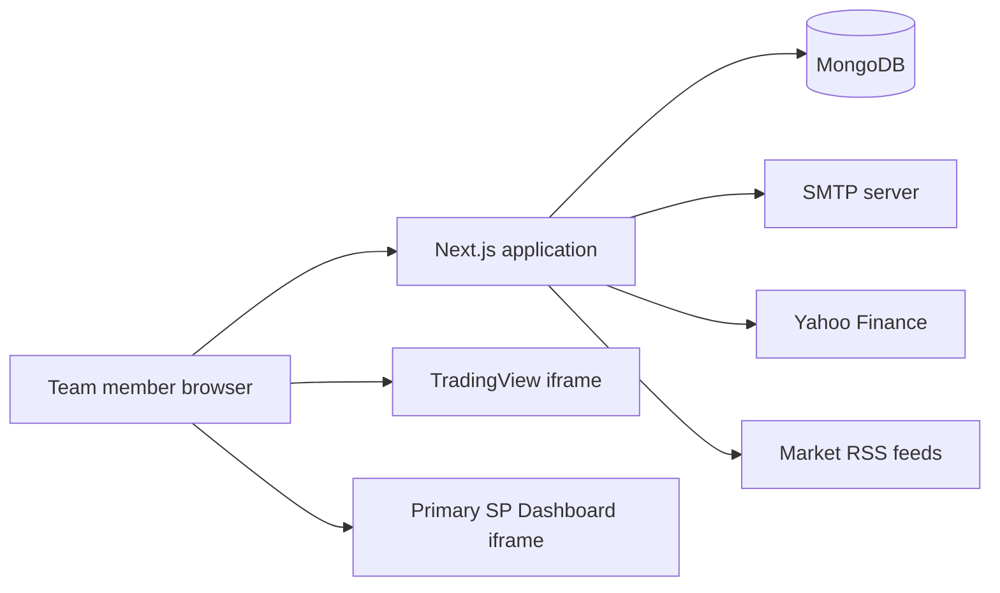

# Architecture

## Purpose

SP Workstation is an internal web application for the Anand Rathi Wealth
Structured Products team. It combines secure team authentication, an Indian
markets home terminal, personal productivity tools, and access to the existing
Primary SP Dashboard.

## Technology stack

- Next.js 16 App Router and React 19
- TypeScript
- Tailwind CSS 4 plus global design tokens
- MongoDB and Mongoose
- `jose` for signed JWTs and `bcryptjs` for password hashing
- Nodemailer for OTP and password-reset email
- Yahoo Finance, RSS, and TradingView for market information

## Runtime topology



The application is a full server-backed Next.js application. It cannot be
deployed as a static export because authentication, API route handlers,
MongoDB access, and server-side redirects require a Node.js runtime.

## Source layout

```text
src/
├── app/
│   ├── api/                    # Route handlers
│   ├── dashboard/              # Protected pages and module host
│   ├── login/                  # Password login
│   ├── otp/                    # Second-factor verification
│   ├── forgot-password/        # Reset request
│   └── reset-password/         # New-password form
├── components/
│   ├── auth/                   # Authentication forms
│   ├── dashboard/              # Shell and dashboard widgets
│   └── theme/                  # Light/dark theme state
├── data/
│   ├── modules.ts              # Workstation module registry
│   └── team.ts                 # Team roster
└── lib/
    ├── models/                 # Mongoose schemas
    ├── auth.ts                 # JWT, cookies, password helpers
    ├── db.ts                   # MongoDB connection lifecycle
    ├── email.ts                # Transactional email
    └── seed.ts                 # Team user provisioning
```

## Rendering model

- Public authentication pages use server pages containing client forms.
- `/dashboard/layout.tsx` verifies the session on the server before rendering
  any dashboard page.
- Dashboard widgets fetch protected application APIs from the browser.
- The Primary SP Dashboard is loaded in an iframe using the route mapping in
  `src/data/modules.ts`.
- The theme is browser-local state stored under `sp-theme`.

There is no global Next.js middleware. Protected page enforcement currently
lives in the dashboard server layout, while each protected API independently
checks `getSession()`.

## Persistence

Production uses MongoDB Atlas through `MONGODB_URI`. Local development may set
`MONGODB_URI=memory`, which starts `mongodb-memory-server`.

The in-memory option is deliberately ephemeral:

- users, OTPs, reset tokens, and todos disappear when the process stops;
- initial users are recreated from the local seed password map;
- it must never be treated as production storage.

See [DATABASE.md](DATABASE.md) for schemas and provisioning.

## External integrations

### Market quotes

`GET /api/markets` requests Yahoo Finance chart data for:

- Nifty 50 (`^NSEI`)
- Sensex (`^BSESN`)
- Bank Nifty (`^NSEBANK`)
- India VIX (`^INDIAVIX`)

The endpoint is best-effort and can return partial or unavailable values.

### Financial news

`GET /api/news` merges RSS items from Economic Times, Moneycontrol, and
Business Standard. It falls back to static headlines if all feeds fail.

### Charts

`LiveCharts` embeds TradingView widgets directly in the browser. Availability,
data delay, and usage terms are controlled by TradingView.

### Primary SP Dashboard

The workstation maps internal module routes to
`NEXT_PUBLIC_SP_DASHBOARD_URL`. The external application must permit iframe
embedding through its own CSP and `X-Frame-Options`; otherwise, users can use
the “Open in new tab” fallback.

## Extension points

### Add a team member

1. Add name, email, and role to `src/data/team.ts`.
2. Add a default password to the untracked
   `scripts/seed-passwords.local.json`, or update
   `SEED_DEFAULT_PASSWORD_MAP`.
3. Run `pwsh ./run.ps1 seed`.

### Add a module

Add a `ModuleGroup` or `SubModule` entry in `src/data/modules.ts`, then add the
corresponding local page or external path. The sidebar renders this registry.

### Add a dashboard widget

Create the component under `src/components/dashboard`, add a protected API
under `src/app/api` if server data is required, and compose it in
`src/app/dashboard/page.tsx`.
