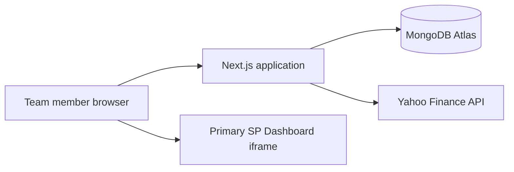

# Architecture

## Purpose

SP Workstation is an internal web application for the Anand Rathi Wealth
Structured Products team. It combines secure team authentication, a live Indian
markets home terminal, and access to the existing Primary SP Dashboard.

## Technology stack

- Next.js 16 App Router and React 19
- TypeScript
- Tailwind CSS 4 plus global design tokens
- MongoDB and Mongoose
- `jose` for signed JWTs and `bcryptjs` for password hashing
- Local system-generated OTP (no email)
- Yahoo Finance for live quotes and OHLC data
- `lightweight-charts` (TradingView open-source) for candlestick charts

## Runtime topology



The application is a full server-backed Next.js application. It cannot be
deployed as a static export because authentication, API route handlers,
MongoDB access, and server-side redirects require a Node.js runtime.

## Source layout

```text
src/
├── app/
│   ├── api/
│   │   ├── auth/               # Login, OTP, reset, seed
│   │   ├── chart/              # Candlestick OHLC data
│   │   └── markets/            # Live index quotes
│   ├── dashboard/              # Protected pages and module host
│   ├── login/                  # Password login
│   ├── otp/                    # Local OTP verification
│   ├── forgot-password/        # Password change request
│   ├── change-password/        # OTP + new password
│   └── reset-password/         # Redirects to change-password
├── components/
│   ├── auth/                   # Authentication forms
│   ├── dashboard/              # Tape, snapshot, chart, sidebar
│   └── theme/                  # Light/dark theme state
├── data/
│   ├── indian-markets.ts       # Index registry and display order
│   ├── modules.ts              # Workstation module registry
│   └── team.ts                 # Team roster
└── lib/
    ├── chart-ist.ts            # IST time formatting, NSE session filter
    ├── chart-series.ts         # Candlestick + volume series builder
    ├── chart-timeframes.ts     # 1D–5Y timeframe definitions
    ├── live-refresh.ts         # 60s polling constant
    ├── market-quote.ts         # Unified price/return formatting
    ├── yahoo-ohlc.ts           # Yahoo quote/OHLC fetch with cache
    ├── models/                 # Mongoose schemas (User, Otp, Todo)
    ├── auth.ts                 # JWT, cookies, password helpers
    ├── db.ts                   # MongoDB connection lifecycle
    └── seed.ts                 # Team user provisioning
```

## Home dashboard layout

1. **Live tape** — auto-scrolling chips with price, change %, sparkline
2. **Snapshot** — horizontal cards for all 13 indices
3. **Live chart** — candlestick chart with timeframe selector (default 1D)

A **Live sync indicator** (green pill) shows last sync time and countdown to
the next 60-second refresh. Tape and snapshot cards use **day change vs previous
close** from `/api/markets`. The **chart header** price stays synced to the same
last price. On **1D**, change/% match Snapshot (vs previous close). On 1W / 1M /
… the chart shows period returns (vs week / month / lookback open), labeled in
the header.

Index display order: main benchmarks → sectors → India VIX → USD/INR.

## Rendering model

- Public authentication pages use server pages containing client forms.
- `/dashboard/layout.tsx` verifies the session on the server before rendering.
- Dashboard widgets fetch protected APIs with session cookies.
- The Primary SP Dashboard loads in an iframe via `src/data/modules.ts`.
- Chart time axis uses IST (Asia/Kolkata). Zoom is **off** by default; users
  can toggle pan/zoom from the chart toolbar.

There is no global Next.js middleware. Protected page enforcement lives in
the dashboard server layout; each protected API checks `getSession()`.

## Persistence

Production uses MongoDB Atlas through `MONGODB_URI`. Local development may set
`MONGODB_URI=memory`, which starts `mongodb-memory-server` (ephemeral).

See [DATABASE.md](DATABASE.md) for schemas and provisioning.

## External integrations

### Market quotes and charts

`GET /api/markets` and `GET /api/chart` fetch Yahoo Finance data server-side
for 13 Indian indices. Yahoo tickers are never exposed in the UI — only index
names (e.g. "Nifty 50") are shown.

### Primary SP Dashboard

The workstation maps internal module routes to `NEXT_PUBLIC_SP_DASHBOARD_URL`.
The external application must permit iframe embedding; otherwise users can use
the “Open in new tab” fallback.

## Extension points

### Add a team member

1. Add name, email, and role to `src/data/team.ts`.
2. Add default password to `scripts/seed-passwords.local.json` or
   `SEED_DEFAULT_PASSWORD_MAP`.
3. Run `pwsh ./run.ps1 seed`.

### Add an index

Add an entry to `src/data/indian-markets.ts` in the desired display position.

### Add a module

Add a `ModuleGroup` or `SubModule` entry in `src/data/modules.ts`.
