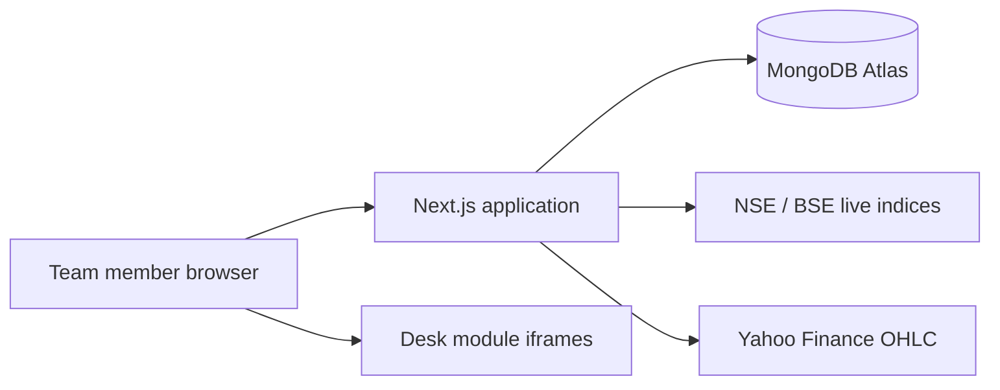

# Architecture

## Purpose

SP Workstation is an internal web application for the Anand Rathi Wealth
Structured Products team. It combines secure team authentication, a live Indian
markets home terminal, and iframe access to desk tools (Primary SP Dashboard,
Gift City AIF, Options Lab, Option Chain Archive).

## Technology stack

- Next.js 16 App Router and React 19
- TypeScript
- Tailwind CSS 4 plus global design tokens
- MongoDB and Mongoose
- `jose` for signed JWTs and `bcryptjs` for password hashing
- Local system-generated OTP (no email)
- **NSE / BSE** for live LTP, session open, and previous close (cash indices)
- Yahoo Finance for OHLC candles (chart path) and fallback quotes
- `lightweight-charts` (TradingView open-source) for candlestick charts

## Runtime topology


```mermaid
flowchart LR
    U[Team member browser] --> N[Next.js application]
    N --> M[(MongoDB Atlas)]
    N --> NSE[NSE / BSE live indices]
    N --> Y[Yahoo Finance OHLC]
    U --> P[Desk module iframes]
```

The application is a full server-backed Next.js application. It cannot be
deployed as a static export because authentication, API route handlers,
MongoDB access, and server-side redirects require a Node.js runtime.

## Source layout

```text
src/
├── app/
│   ├── api/
│   │   ├── auth/               # Login, OTP, reset, seed
│   │   ├── chart/              # Candlestick OHLC data
│   │   └── markets/            # Live index quotes
│   ├── dashboard/              # Protected pages and module host
│   ├── login/                  # Password login
│   ├── otp/                    # Local OTP verification
│   ├── forgot-password/        # Password change request
│   ├── change-password/        # OTP + new password
│   └── reset-password/         # Redirects to change-password
├── components/
│   ├── auth/                   # Authentication forms
│   ├── dashboard/              # Tape, snapshot, chart, sidebar
│   └── theme/                  # Light/dark theme state
├── data/
│   ├── indian-markets.ts       # Index registry and display order
│   ├── modules.ts              # Workstation module registry
│   └── team.ts                 # Team roster
└── lib/
    ├── chart-ist.ts            # IST time formatting, NSE session filter
    ├── chart-series.ts         # Candlestick + volume series builder
    ├── chart-timeframes.ts     # 1D–5Y timeframe definitions
    ├── live-refresh.ts         # 15s open / 15m closed polling
    ├── market-quote.ts         # Unified price/return formatting
    ├── nse-indices.ts          # NSE allIndices live quotes
    ├── bse-sensex.ts           # BSE Sensex live quote
    ├── session-spark.ts        # Tape/snapshot session bar selection
    ├── yahoo-ohlc.ts           # Yahoo quote/OHLC fetch with cache
    ├── models/                 # Mongoose schemas (User, Otp, Todo)
    ├── auth.ts                 # JWT, cookies, password helpers
    ├── db.ts                   # MongoDB connection lifecycle
    └── seed.ts                 # Team user provisioning
```

## Home dashboard layout

1. **Live tape** — auto-scrolling chips with price, change %, sparkline
2. **Snapshot** — horizontal cards for all 13 indices (minimal card padding)
3. **Live chart** — ~70% candlestick pane / ~30% quote panel, timeframe selector
   (default 1D), Zoom toggle, and **Expand** for a centered fullscreen overlay

A **Live sync indicator** shows last sync time. While cash markets are open or
in pre-open, clients poll about every **15 seconds** (`LIVE_REFRESH_MS`). When
closed / weekend / holiday, polling slows to **15 minutes**
(`CLOSED_REFRESH_MS`).

### Day change semantics (Zerodha cross-check)

| Surface | Primary day % | Also shown |
|---|---|---|
| Tape / Snapshot | **vs session open** (NSE/BSE open) | — |
| Chart quote panel (1D) | **vs session open** (aligned with tape) | **vs previous close** |

Post-trade (after 15:30 IST on a trading day):

- LTP freezes to the venue last (NSE/BSE), not a prior-day Yahoo close
- Session selection uses **today’s completed bars** (not yesterday)
- Session open prefers **exchange open** over Yahoo’s first print
- **vs previous close** must match NSE / Zerodha day change

Index display order: main benchmarks → sectors → India VIX.

## Rendering model

- Public authentication pages use server pages containing client forms.
- `/dashboard/layout.tsx` verifies the session on the server before rendering.
- Dashboard widgets fetch protected APIs with session cookies.
- Desk modules load in iframes via `src/data/modules.ts`.
- Chart time axis uses IST (Asia/Kolkata). Zoom is **off** by default; users
  can toggle pan/zoom from the chart toolbar. Expanding the chart keeps the
  same chart instance mounted (no candle reload flash).
- **Zoom On** loads full available history immediately (`/api/chart?full=1`).
  For **1D**, Yahoo’s 5m feed only covers ~60 days, so Zoom On switches to
  multi-year **daily** bars (~10y) rather than paging short intraday chunks.
  **Zoom Off** clips back to the active period window (session / week / …).

There is no global Next.js middleware. Protected page enforcement lives in
the dashboard server layout; each protected API checks `getSession()`.

## Persistence

Production uses MongoDB Atlas through `MONGODB_URI`. Local development may set
`MONGODB_URI=memory`, which starts `mongodb-memory-server` (ephemeral).

See [DATABASE.md](DATABASE.md) for schemas and provisioning.

## External integrations

### Market quotes and charts

`GET /api/markets` prefers NSE (cash indices) and BSE (Sensex) for LTP, open,
and previous close. Yahoo Finance supplies OHLC bars for `/api/chart` and is a
fallback when a venue miss occurs. Yahoo tickers are never exposed in the UI —
only index names (e.g. "Nifty 50") are shown.

Intraday chart high/low can differ slightly from NSE’s official day range
because candles come from Yahoo’s interval bars; close and previous close are
pinned to the venue.

### Desk modules

The workstation maps internal module routes to:

- `NEXT_PUBLIC_SP_DASHBOARD_URL` — Primary SP Dashboard
- `NEXT_PUBLIC_GIFT_CITY_AIF_URL` — Gift City AIF backtester
- `NEXT_PUBLIC_OPTIONS_LAB_URL` — Options Lab
- `NEXT_PUBLIC_OPTION_CHAIN_ARCHIVE_URL` — Option Chain Archive

External apps must permit iframe embedding; otherwise users can use the
“Open in new tab” fallback.

## Extension points

### Add a team member

1. Add name, email, and role to `src/data/team.ts`.
2. Add default password to `scripts/seed-passwords.local.json` or
   `SEED_DEFAULT_PASSWORD_MAP`.
3. Run `pwsh ./run.ps1 seed`.

### Add an index

Add an entry to `src/data/indian-markets.ts` in the desired display position.

### Add a module

Add a `ModuleGroup` or `SubModule` entry in `src/data/modules.ts`.
